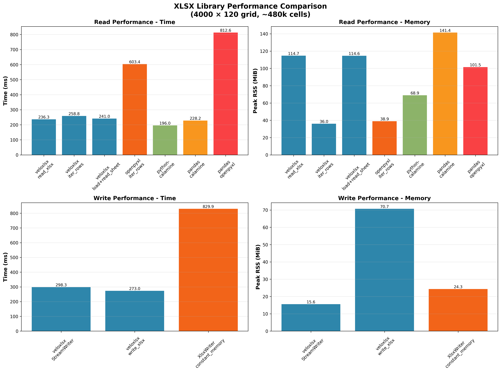
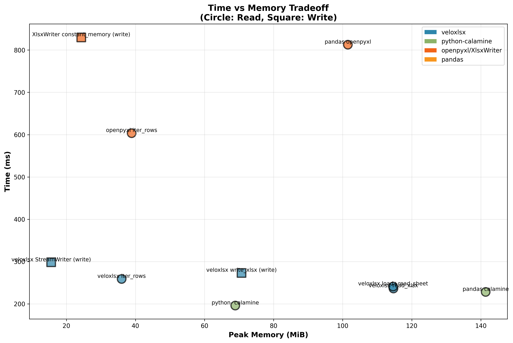

Architecture and Performance
============================

``veloxlsx`` keeps the Python API small and moves XLSX parsing and writing into
Rust. The implementation is optimized around workbook values rather than a rich
Excel object model.

Read Paths
----------

.. graphviz::

   digraph read_modes {
       rankdir=LR;
       node [shape=box, style=filled, fontname="Arial"];

       subgraph cluster_read_xlsx {
           label = "read_xlsx()";
           style=filled;
           color=lightblue;
           file [label="XLSX file"];
           zip [label="Open ZIP"];
           parse [label="Parse worksheet XML"];
           grid [label="Build full grid"];
           python [label="Return Python lists"];
           file -> zip -> parse -> grid -> python;
       }

       subgraph cluster_iter_rows {
           label = "iter_rows()";
           style=filled;
           color=lightgreen;
           file2 [label="XLSX file"];
           zip2 [label="Open ZIP"];
           parse2 [label="Stream parse rows"];
           yield [label="Yield Python row"];
           file2 -> zip2 -> parse2 -> yield;
       }

       subgraph cluster_load {
           label = "load() + read_sheet()";
           style=filled;
           color=lightyellow;
           file3 [label="XLSX file"];
           zip3 [label="Open reusable ZIP"];
           wb [label="Workbook metadata"];
           sheet [label="Read sheet on demand"];
           file3 -> zip3 -> wb -> sheet;
       }
   }

.. list-table::
   :header-rows: 1
   :widths: 24 38 38

   * - API
     - Memory behavior
     - Best use
   * - ``read_xlsx``
     - Materializes the full sheet as nested Python lists.
     - Small and medium files where a complete in-memory grid is convenient.
   * - ``iter_rows``
     - Yields one row at a time and avoids a full grid for common row-based sheet XML.
     - Large files, streaming transforms, filters, and ingestion jobs.
   * - ``load`` + ``read_sheet``
     - Reuses workbook metadata and the ZIP archive, then materializes requested sheets.
     - Multi-sheet workflows where more than one operation uses the same file.

Some legacy sparse worksheet layouts may require buffering internally because
the row boundaries needed for streaming are not represented in the usual way.

Write Paths
-----------

.. graphviz::

   digraph write_modes {
       rankdir=LR;
       node [shape=box, style=filled, fontname="Arial"];

       subgraph cluster_write_xlsx {
           label = "write_xlsx()";
           style=filled;
           color=lightblue;
           data [label="Python grid"];
           dedup [label="Deduplicate strings"];
           sst [label="Build shared string table"];
           write [label="Write XLSX"];
           data -> dedup -> sst -> write;
       }

       subgraph cluster_stream_writer {
           label = "StreamWriter";
           style=filled;
           color=lightgreen;
           data2 [label="Rows arrive over time"];
           inline [label="Write inline strings"];
           write2 [label="Write XLSX incrementally"];
           data2 -> inline -> write2;
       }
   }

.. list-table::
   :header-rows: 1
   :widths: 24 38 38

   * - API
     - Memory behavior
     - Best use
   * - ``write_xlsx``
     - Requires the input grid and builds a shared string table.
     - Existing in-memory data where string deduplication may reduce file size.
   * - ``StreamWriter``
     - Writes rows incrementally with inline strings.
     - Large exports, generator-driven data, and bounded-memory workflows.

Performance Characteristics
---------------------------

These sample results use a generated 4000 x 120 numeric grid, about 480k cells.
They are indicative, not a universal ranking.

.. list-table:: Read performance
   :header-rows: 1
   :widths: 42 18 20 20

   * - Method
     - Time (ms)
     - Peak RSS (MiB)
     - Best for
   * - ``read_xlsx``
     - 236
     - 115
     - Simple full-sheet reads.
   * - ``iter_rows``
     - 259
     - 36
     - Streaming large sheets.
   * - ``load`` + ``read_sheet``
     - 241
     - 115
     - Reusing workbook metadata.
   * - python-calamine
     - 196
     - 69
     - Fast read-only extraction.
   * - openpyxl read-only
     - 603
     - 39
     - Feature-aware reading.

.. list-table:: Write performance
   :header-rows: 1
   :widths: 42 18 20 20

   * - Method
     - Time (ms)
     - Peak RSS (MiB)
     - Best for
   * - ``write_xlsx``
     - 273
     - 71
     - In-memory grids.
   * - ``StreamWriter``
     - 298
     - 16
     - Bounded-memory exports.
   * - XlsxWriter ``constant_memory``
     - 830
     - 24
     - Rich write-only XLSX generation.

Benchmark Charts
----------------

Run Larger Benchmarks
---------------------

.. code-block:: bash

   export VELOXLSX_BENCH_ROWS=100000
   export VELOXLSX_BENCH_COLS=500
   python benchmarks/memory_timing.py

The benchmark command generates the workbook once, runs each scenario in a
subprocess, and reports wall time plus peak RSS. See
``benchmarks/large_file_benchmark_template.py`` for a starting point when
testing larger local workloads.
